# RadioChron Desktop

Local-first Windows and macOS desktop diagnostics for recording Wi-Fi state,
tracking nearby Bluetooth Low Energy identities, comparing observations, and
turning transient network problems into evidence for a support ticket.

This is a separate Electron repository. It imports the public Node API from
[`radiochron-js`](https://github.com/sergii-ziborov/radiochron-js), which links
the [`radiochron`](https://github.com/sergii-ziborov/radiochron) Rust IoT core
through its packaged native Node adapter.

> Open-source beta. Download the unsigned test installers from
> [`desktop-v0.2.0-beta.3`](https://github.com/sergii-ziborov/radiochron-electron/releases/tag/desktop-v0.2.0-beta.3).
> Windows SmartScreen and macOS Gatekeeper may warn because this beta is not
> code-signed or notarized yet.

## Screenshots

Every value below is synthetic. SSIDs are invented, MAC addresses are locally
administered, and IP addresses come from documentation-only ranges.

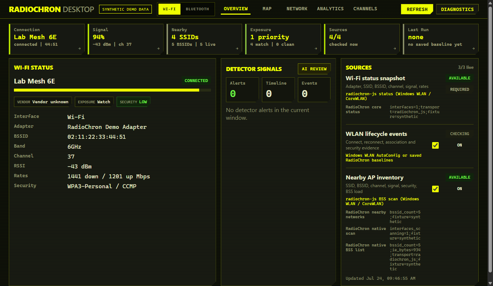

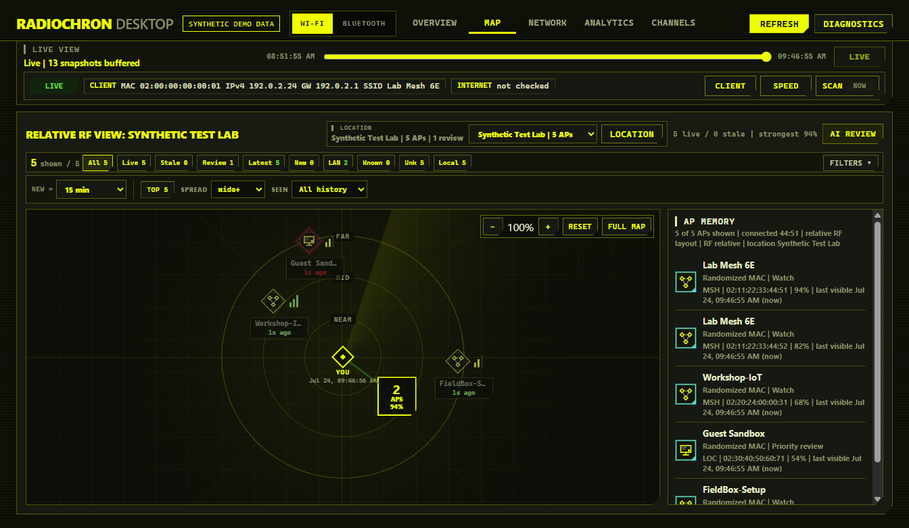

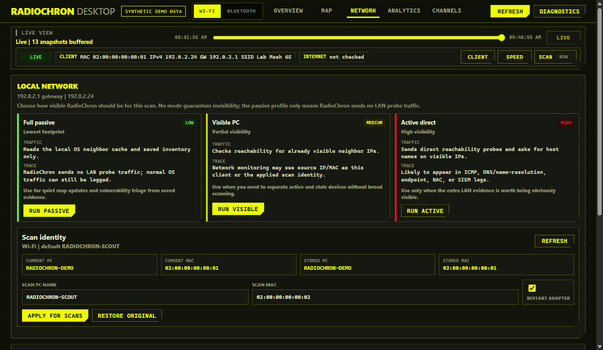

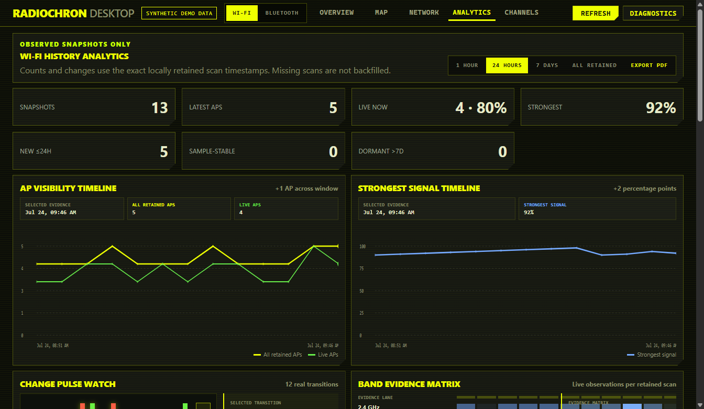

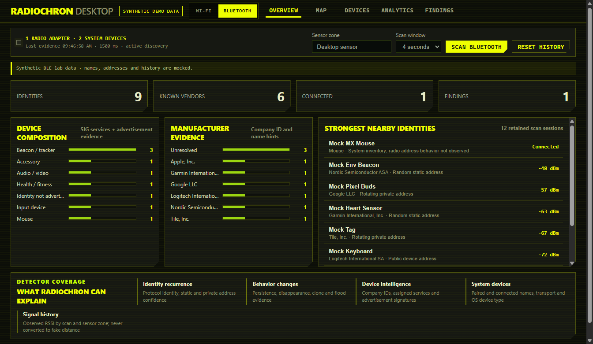

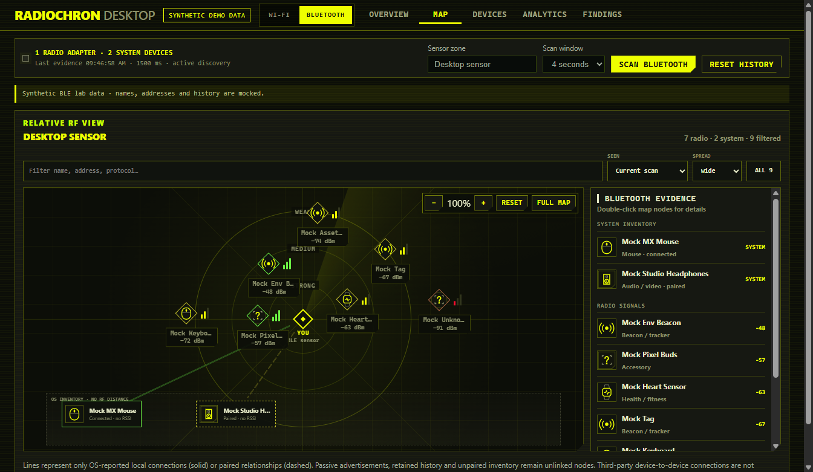

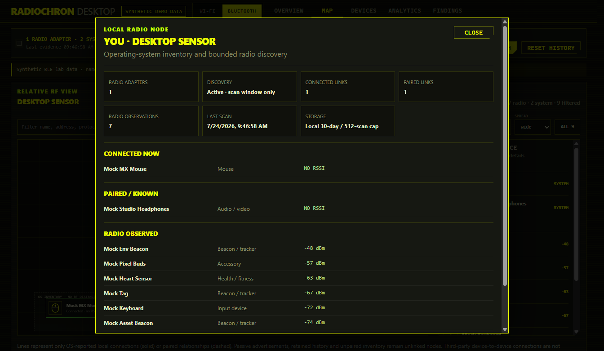

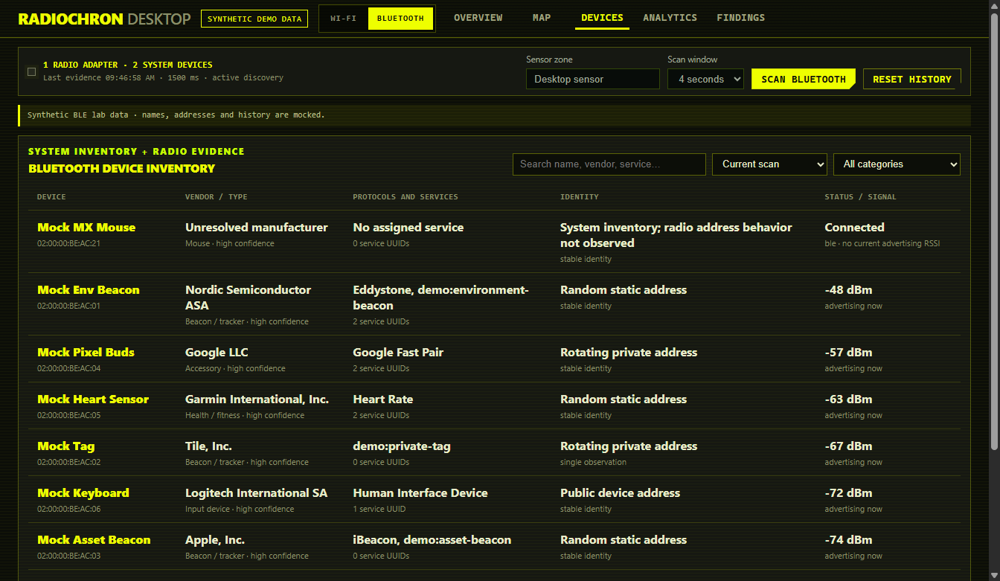

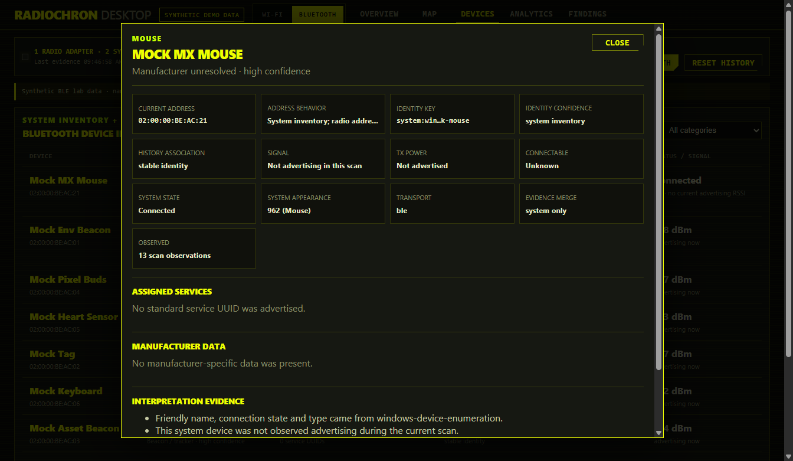

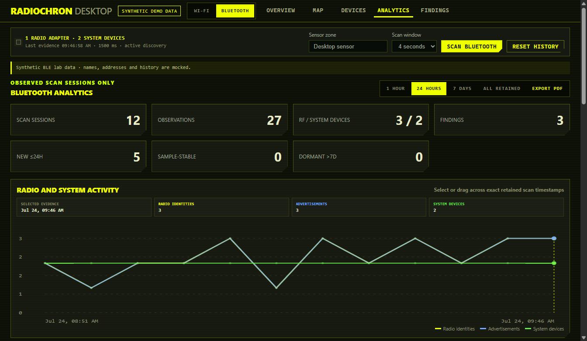

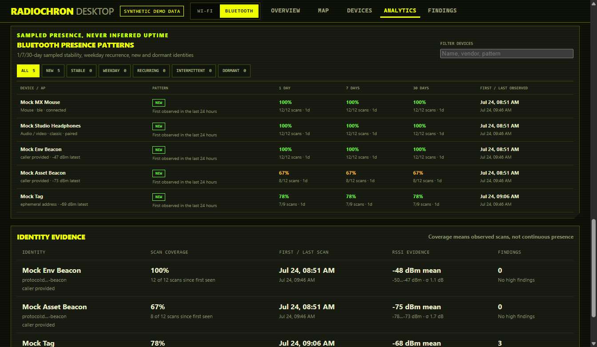

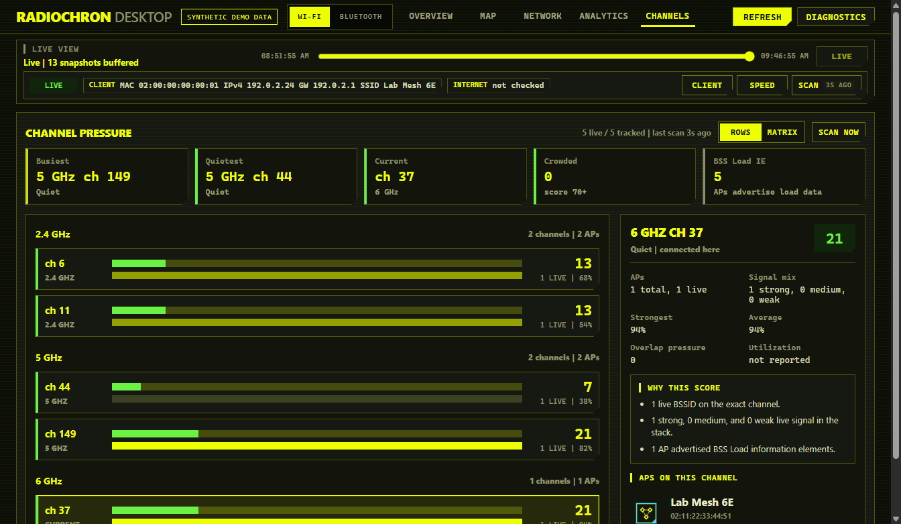

## What is implemented

- Native interface/association status and nearby BSS inventory through
  `radiochron-js` and the RadioChron Rust core.
- Typed Rust-core analysis, radio/authentication/DHCP/DNS/TCP/Internet path
  diagnosis, and an automatically started change-only local chronicle through
  `radiochron-js` (never through MCP).
- Windows Native WLAN and macOS CoreWLAN collectors with raw 802.11
  Information Element summaries, RSSI, channel, band, and security evidence.
- Native BLE scanning through Windows WinRT and macOS CoreBluetooth, with
  local identity history, persistence/disappearance, possible-clone and beacon
  flood evidence. Findings always include limitations; RSSI is not presented
  as physical distance.
- CoreBluetooth peer UUIDs survive private-address rotation on macOS. On
  Windows/Linux, recent anonymous rotations are associated one-to-one only
  when timing, advertisement family and RSSI agree; the UI labels this
  probabilistic instead of inventing a permanent device UUID. Old one-off
  private addresses remain in Analytics but stop appearing as retained devices;
  Map and Devices open on current evidence, with retained/recurring views still
  available through filters.
- Windows system Bluetooth inventory through DeviceInformation for friendly
  names, Classic/BLE transport, paired/connected state, and OS device type.
  It is joined to advertising evidence only when the Bluetooth address matches
  exactly; connected devices such as mice remain visible even when they are
  not currently advertising.
- Equal top-level Wi-Fi/Bluetooth workspaces. Bluetooth has Overview, relative
  RF Map, searchable Devices, Analytics, and Findings views with stable shared
  navigation and scanner controls.
- BLE device intelligence resolves 3,900+ Bluetooth SIG Company IDs from a
  pinned MIT-licensed assigned-numbers snapshot, interprets common assigned
  services and beacon/Fast Pair signatures, and exposes evidence in a detailed
  device card. Unknown identifiers remain visible instead of being guessed.
- Wi-Fi and Bluetooth share one RF-map viewport engine: anchored Ctrl+wheel
  zoom, pointer pan, fullscreen, circular metric-space rings, ResizeObserver
  sizing, spread profiles, deterministic collision separation, search, and
  retained-history filters through 30 days. The clickable `You` node exposes
  OS-reported connected and paired relationships. Passive advertisements,
  retained evidence, and unpaired OS inventory remain unlinked nodes because
  they do not prove a connection. Third-party device-to-device links are not
  exposed by standard BLE discovery. System-only devices without RSSI stay in
  an explicit OS-inventory lane and never receive a fake RF position.
- Retained BLE Analytics combines selectable exact-scan timelines, identity
  and detector pulse watches, an RSSI/recurrence matrix, system connected-device
  counts, scan coverage, and filterable 1/7/30-day sampled-presence patterns
  including new, stable, weekday, recurring, intermittent and dormant evidence.
- Bluetooth discovery is always bounded by the selected 2/4/8-second scan
  window. Windows uses active discovery during that window to request names and
  service metadata; macOS and Linux use their OS-managed discovery behavior.
- Wi-Fi Analytics combines exact-snapshot timelines, an appeared/not-observed
  pulse watch, band/AP signal matrices, current security/vendor/channel
  breakdowns, and the same 1/7/30-day presence-pattern model.
- Saved baseline runs, comparisons, reconnect/environment observations,
  evidence timelines, and diagnostic bundles.
- AP/device inventory, a relative RF map, channel-pressure view, passive
  vulnerability context, rich Wi-Fi/Bluetooth history PDFs, and expanded
  location/LAN evidence reports.
- Windows-only WLAN AutoConfig history, saved-profile inspection,
  local-neighbor workflow, and temporary scan-identity controls.
- A safe screenshot mode that never reads the host radio or network identity.

The RF map defaults to the `0.25` `wide+` spread correction so nearby synthetic
or real AP nodes remain readable instead of collapsing around the center.

## Platform support

| Capability | Windows x64 | Intel Mac | Apple Silicon Mac |
|---|---:|---:|---:|
| Current association | yes | yes | yes |
| Nearby BSS + beacon metadata | yes | yes | yes |
| BLE advertisements + local history | yes | yes | yes |
| Paired/connected Bluetooth names and type | yes | advertisement evidence only | advertisement evidence only |
| Saved RadioChron baselines | yes | yes | yes |
| WLAN AutoConfig event history | yes | no OS equivalent | no OS equivalent |
| Saved Wi-Fi key / scan identity controls | yes | no | no |
| Installer artifact | NSIS `.exe` | DMG + ZIP | DMG + ZIP |

Recent macOS versions require Location Services before CoreWLAN exposes SSID,
BSSID, and scan identity. The bundle includes the usage description; permission
must still be granted interactively. Bluetooth access also requires an
interactive macOS permission grant. Public macOS downloads must be signed with
Developer ID and notarized.

## Architecture

```text
radiochron-electron (Electron + React)
        |
        | import "radiochron"
        v
radiochron-js (Node/npm library)
        |
        | packaged radiochron-node-bridge
        v
radiochron (Rust IoT core)
        |-- portable Wi-Fi + BLE models/history/detectors
        |-- Windows Native WLAN + WinRT BLE
        |-- Linux nl80211 + BlueZ BLE
        `-- macOS CoreWLAN + CoreBluetooth
```

The native adapter keeps the JavaScript runtime and Rust collector
process-isolated. Electron uses the typed Wi-Fi, connectivity, chronicle, BLE
scan, identity-history and detector APIs. Other Node applications can use the
same `radiochron-js` package without Electron. MCP is not part of this process.

## Development

Requirements: Node.js 22.12+ and Rust 1.85+.

```sh
npm ci
npm run native:build
npm run dev
```

Quality checks:

```sh
npm run check
npm run build
```

Regenerate the same privacy-safe screenshots used by this README and the site:

```sh
npm run screenshots
```

Refresh the pinned, generated Bluetooth Company ID lookup:

```sh
npm run data:ble-assigned-numbers
```

`RADIOCHRON_DEMO=1` activates synthetic IPC fixtures. The fixture uses
`192.0.2.0/24`, `2001:db8::/32`, invented BLE beacons, and locally administered
MAC addresses. It does not query CoreWLAN, CoreBluetooth, Windows WLAN/Bluetooth
APIs, profile secrets, neighbor tables, or the real computer identity.

## Installers

Build on the target operating system:

```sh
# Windows x64 - assisted NSIS installer
npm run dist:win -- --x64

# macOS - choose the host architecture
npm run dist:mac -- --arm64
npm run dist:mac -- --x64
```

Outputs are written to `release/`. The native Node adapter and its provenance
file are embedded in the packaged resources. GitHub Actions builds Windows x64,
Intel Mac, and Apple Silicon installer artifacts. The current unsigned beta is
available for [Windows x64](https://github.com/sergii-ziborov/radiochron-electron/releases/download/desktop-v0.2.0-beta.3/RadioChron-Desktop-0.2.0-Windows-x64.exe),
[Apple Silicon](https://github.com/sergii-ziborov/radiochron-electron/releases/download/desktop-v0.2.0-beta.3/RadioChron-Desktop-0.2.0-macOS-Apple-Silicon.dmg),
and [Intel Mac](https://github.com/sergii-ziborov/radiochron-electron/releases/download/desktop-v0.2.0-beta.3/RadioChron-Desktop-0.2.0-macOS-Intel.dmg).

These beta installers are for testing. Windows code signing and macOS Developer
ID signing/notarization are still required for a production release.

A matching `v<package-version>` tag starts the production release workflow. It
fails closed without `WIN_CSC_LINK`/`WIN_CSC_KEY_PASSWORD` or the macOS
Developer ID and App Store Connect API-key secrets, verifies both architectures,
writes SHA-256 manifests, and creates a draft GitHub release for final review.

## Privacy and safety

- No telemetry, cookies, or analytics.
- Runtime state stays in the Electron user-data directory unless exported.
- BLE analytics retain privacy-minimized scan sessions for at most 30 days or
  512 scans. Raw Bluetooth addresses and manufacturer/service payload bytes are
  not written to that archive. It retains opaque identity and continuity keys,
  association confidence, Company IDs, advertised service UUIDs, names, RSSI,
  zones, and timestamps; `Reset history` clears it together with the Rust
  tracker.
- SSIDs, BSSIDs, MAC addresses, IP configuration, and diagnostic bundles are
  sensitive network/location evidence; inspect them before sharing.
- Saved Wi-Fi secrets are Windows-only, revealed only after an explicit action,
  and never written to RadioChron inventory or demo fixtures.
- The renderer has no Node access; preload exposes a bounded, validated IPC API.

See [PRIVACY.md](PRIVACY.md), [SECURITY.md](SECURITY.md), and
[THIRD_PARTY_NOTICES.md](THIRD_PARTY_NOTICES.md).

## Repository family

- [`radiochron`](https://github.com/sergii-ziborov/radiochron) — dependency-light
  Rust IoT core.
- [`radiochron-js`](https://github.com/sergii-ziborov/radiochron-js) — Node/npm
  library over the core.
- [`radiochron-electron`](https://github.com/sergii-ziborov/radiochron-electron)
  — this separate desktop application.
- [`radiochron-site`](https://github.com/sergii-ziborov/radiochron-site) — website
  source.

Licensed under the [MIT License](LICENSE-MIT). The underlying `radiochron`
Rust core remains separately dual-licensed under MIT or Apache-2.0.
